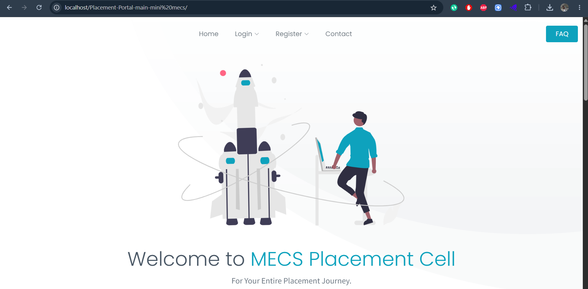
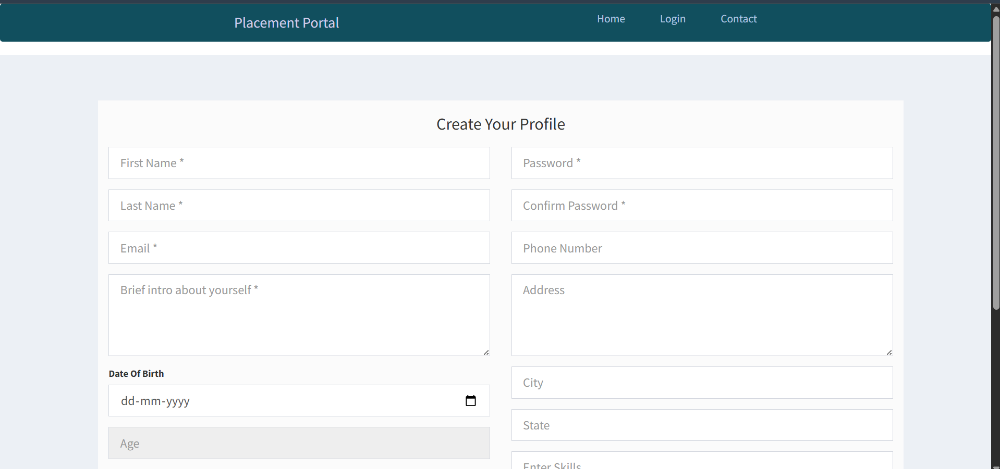
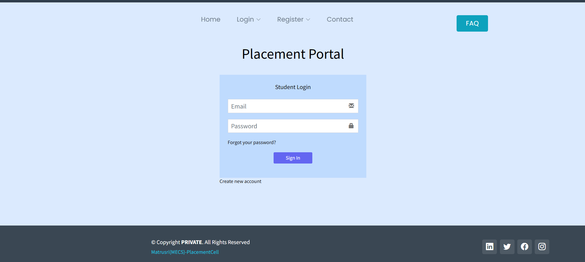
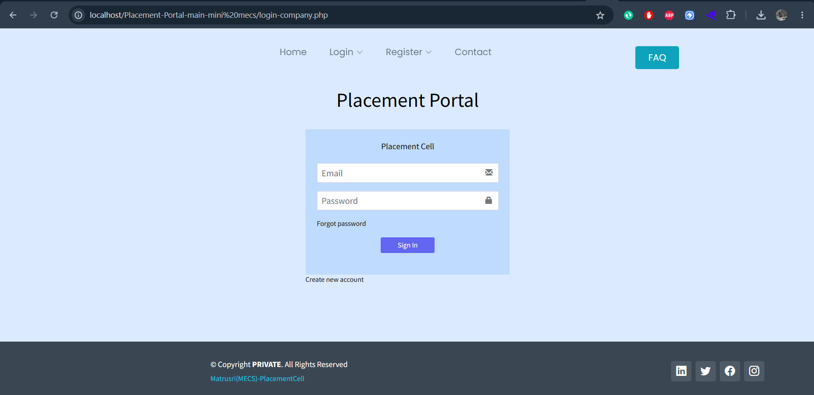
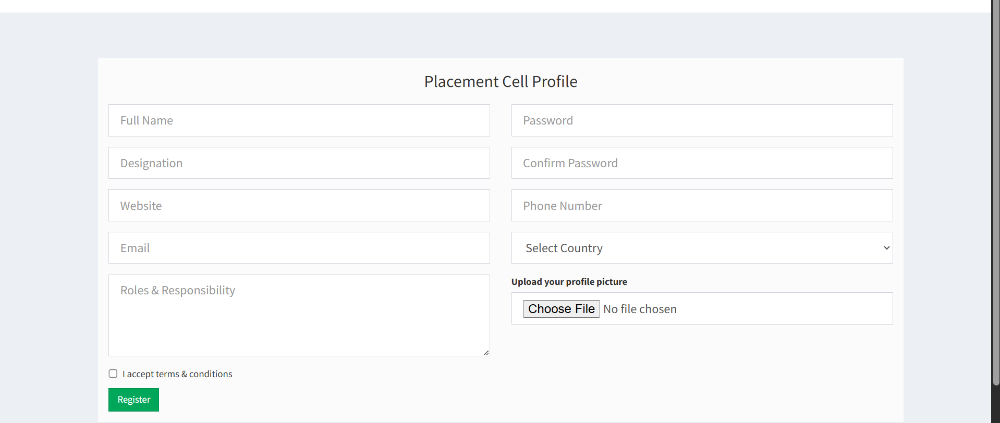
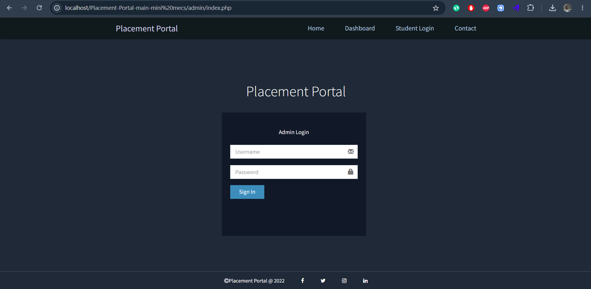
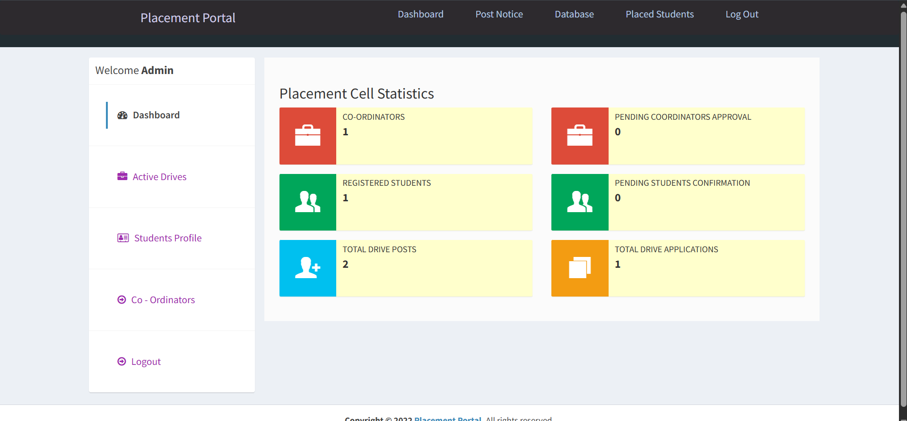
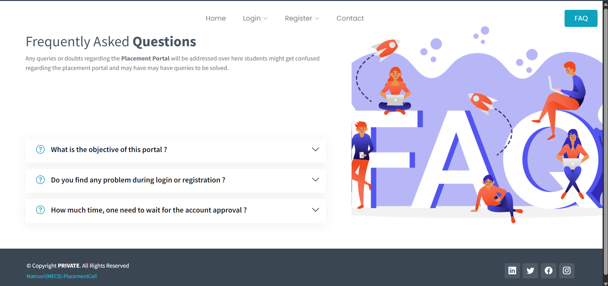
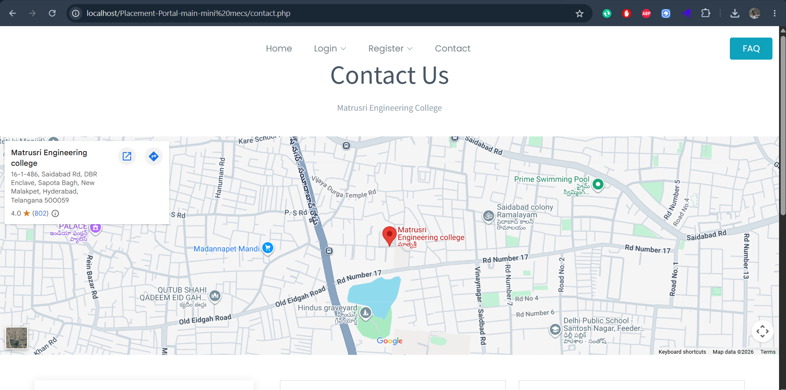
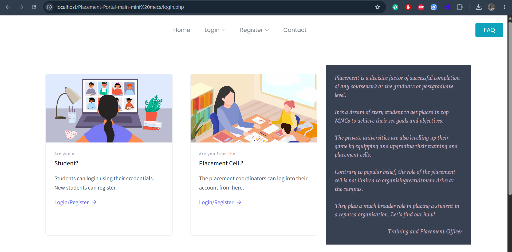

# MECS Placement Portal

## Topic – College Related

---

## Problem Statement

Students often visit multiple websites and blogs to find job opportunities and placement updates. Due to scattered information, many students miss opportunities.

The Placement Portal provides a centralized platform where students can access placement drives, notices, registration, and career-related information efficiently.

It also helps students connect with coordinators and administrators for placement activities.

---

# Introduction

The Placement Management System is a web application developed for the Training and Placement Department of the college.

This system allows students to upload and manage their academic and personal details securely. Coordinators and administrators can monitor placement drives, approve registrations, publish notices, and manage student records.

The system follows a one-time registration model and improves placement process efficiency through digital management.

---

# Features

* Separate Login for Admin, Placement Cell and Student
* Interactive Dashboard
* Placement Drive Management
* Student Registration System
* Company Registration Approval
* Admin Notice Management
* Upload Technical Papers
* View Student and Company Profiles
* Contact Support Page
* Secure Data Management

---

# Technology Stack

* HTML
* CSS
* JavaScript
* Bootstrap
* PHP
* MySQL

---

# PROJECT SNAPSHOTS

## Home Page



---

## Student Registration



---

## Student Login



---

## Placement Cell Login



---

## Placement Cell Register



---

## Admin Login



---

## Admin Dashboard



---

## FAQ Page



---

## Contact Us



---

## Logout Page



---

# Getting Started

## Prerequisites

Install:

* XAMPP

Start:

* Apache
* MySQL

---

## Installation

### Step 1 — Clone Repository

```bash
cd C:\xampp\htdocs\
git clone https://github.com/SumithNetha/MECS-Placement-Portal.git
```

---

### Step 2 — Move Project

Place project inside:

```text
C:\xampp\htdocs\Placement-Portal-main
```

---

### Step 3 — Create Database

Open:

```text
http://localhost/phpmyadmin
```

Create database:

```text
placement_portal
```

---

### Step 4 — Import Database

Import:

```text
database/db1.sql
```

---

### Step 5 — Configure Database

Open:

```text
db.php
```

Set:

```php
$servername="localhost";
$username="root";
$password="";
$dbname="placement_portal";
```

---

### Step 6 — Run Project

Open browser:

```text
http://localhost/Placement-Portal-main
```

---

# Folder Structure

```text
Placement-Portal-main
│
├── admin
├── assets
├── company
├── database
├── screenshots
├── uploads
├── user
├── index.php
├── db.php
└── README.md
```

---

# Future Enhancements

* Resume Analyzer
* Email Notifications
* Placement Analytics Dashboard
* AI-based Job Recommendation
* Student Performance Tracking

---


